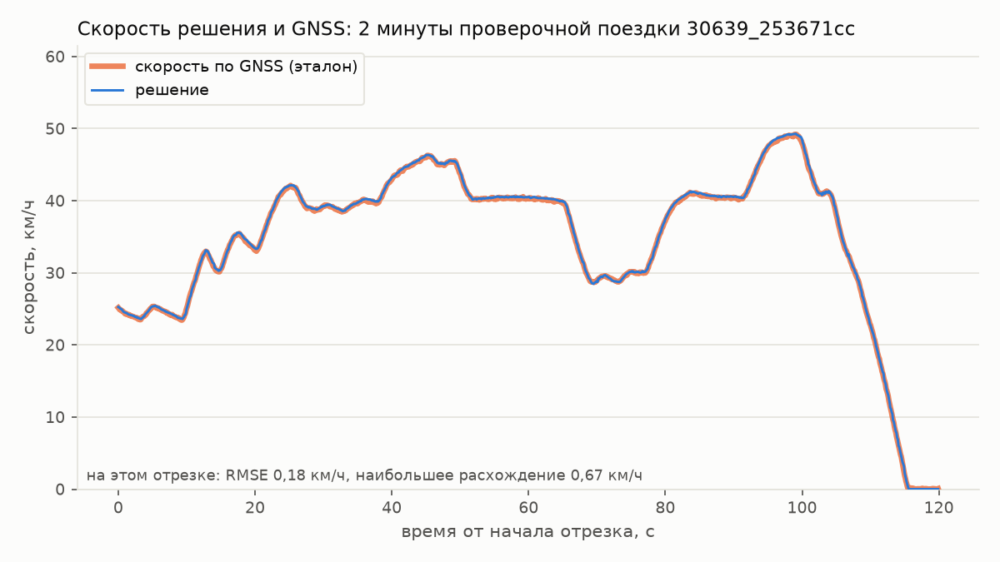
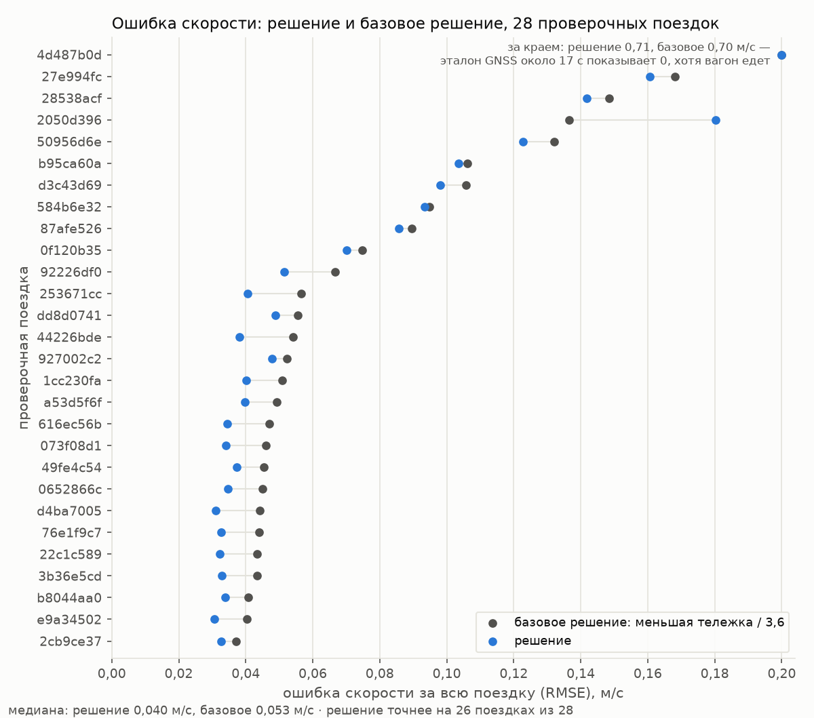
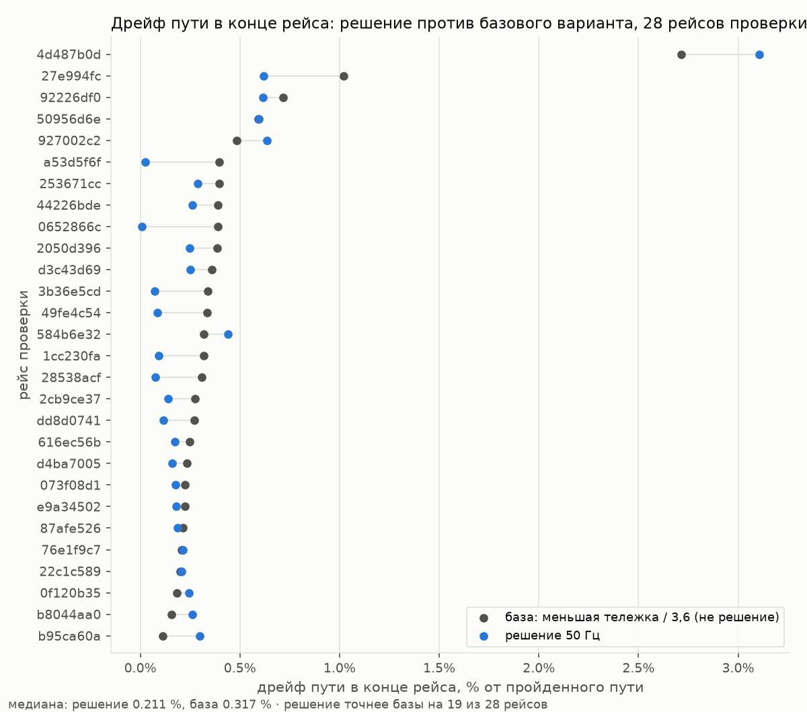
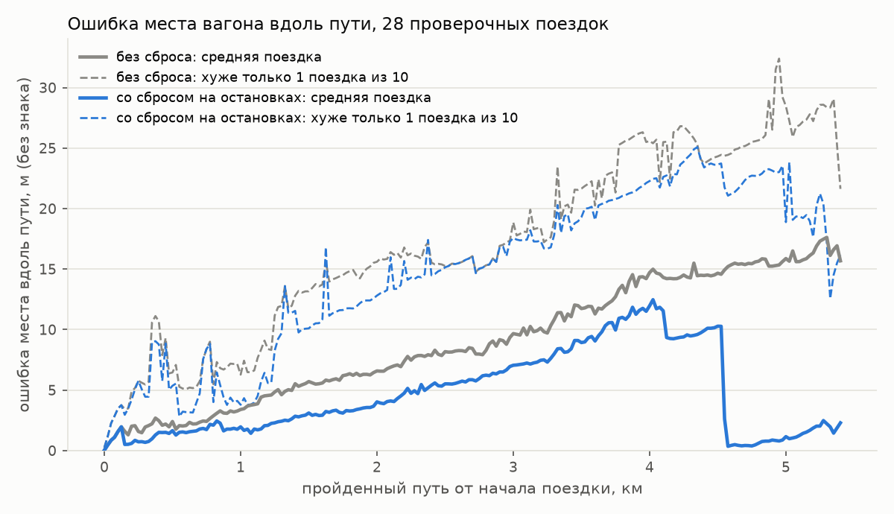
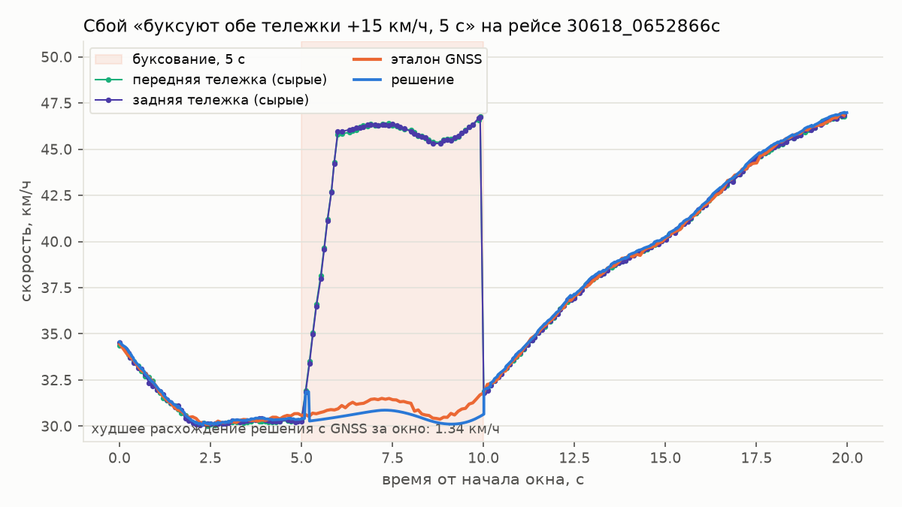

# Точность и быстродействие

## Как считали

- **Поездки.** 122 записи = 97 разных; годных для оценки точности (целая поездка, есть GNSS, запись не
  является копией другой) — 68: вагон 30618 — 51 поездка, вагон 30639 — 17. Поездки разделены на 40
  обучающих и 28 проверочных, поровну по «вагон + дата» (см. README, Термины). Все числа модели подобраны
  только на обучающих поездках; таблицы ниже — только на 28 проверочных.
- **Тот же код, что в узле.** Офлайн-прогон (расчёт без запуска настоящего ROS, тем же кодом) подаёт
  сообщения тележек, ручки и GNSS в порядке записи и снимает выход по таймеру 50 Гц — так же, как это
  делает узел ROS в решении.
- **Эталон** (см. README, Термины) — здесь это GNSS самих поездок: скорость эталона — скорость по GNSS;
  путь эталона — путь, накопленный сложением скорости GNSS по времени (скорость ниже 0,2 м/с считается
  нулём; простое сложение расстояний между отдельными точками GNSS даёт ошибку в метры из-за шума в
  координатах); место эталона — точка, которую в этот момент определил приёмник GNSS, перенесённая от
  антенны к базовой точке кузова вагона (base_link), к которой относится наша оценка положения. Оценка и
  эталон сопоставляются по сообщению с самой близкой меткой времени, расхождение не больше ±0,05 с.
- **RMSE, MAE, дрейф пути, базовое решение** — см. README, Термины. Базовое решение показано в таблицах
  ниже только для сравнения: оно передаёт на выход любое неправильное показание тележки без проверки —
  **это не решение**.

## Критерий 1. Скорость (28 проверочных поездок, медиана по поездкам)

| Метрика | Решение | Базовое решение |
|---|---|---|
| RMSE, м/с | **0,040** | 0,053 |
| MAE (среднее из абсолютных ошибок, без утяжеления больших), м/с | **0,025** | 0,032 |
| Смещение (систематическая ошибка в одну сторону) за всю поездку, м/с | +0,007 | −0,011 |
| Смещение при разгоне (ручка > 0), м/с | **+0,011** | −0,036 |
| Смещение при торможении (ручка < 0), м/с | +0,017 | +0,020 |
| Смещение на выбеге (ручка 0), м/с | +0,011 | −0,015 |
| Смещение на стоянке (скорость по GNSS < 1 км/ч), м/с | −0,007 | −0,008 |

Среднее (не медиана) RMSE по поездкам — 0,087 м/с: его сильно увеличивает одна поездка, на которой эталон
GNSS около 17 с показывает 0, хотя вагон едет (скорость тележек > 3 м/с); на этой поездке RMSE 0,70 у
любого варианта расчёта. Без неё среднее — 0,064 м/с (у базового решения — 0,071).

*Скорость по GNSS (оранжевая линия) и скорость решения (синяя) на двух минутах проверочной поездки
30639_253671cc. Поездка выбрана так: её ошибка скорости за всю поездку ближе всех к медиане (0,040 м/с).
Отрезок выбран с самыми заметными разгонами и торможениями. На этом отрезке RMSE 0,18 км/ч (0,05 м/с),
наибольшее расхождение 0,67 км/ч.*

*Ошибка скорости (RMSE) за всю поездку, по каждой из 28 проверочных поездок: синим — решение, серым —
базовое решение. Медиана: решение 0,040 м/с, базовое решение 0,053 м/с; решение точнее на 26 поездках из
28. Хуже — на двух. На поездке 4d487b0d испорчен эталон GNSS (0,71 против 0,70 м/с, см. выше). На поездке
2050d396 (0,18 против 0,14 м/с) почти вся ошибка — два торможения с юзом: решение перестало верить
тележкам и несколько секунд считало скорость по ручке, а уравнение движения дало торможение сильнее
настоящего, до 9 км/ч ниже GNSS.*

## Критерий 2. Путь и положение (28 проверочных поездок)

**Путь вдоль направления движения** (медиана по поездкам):

| Метрика | Решение | Базовое решение |
|---|---|---|
| Дрейф в конце поездки, % от пути | **0,21** | 0,32 |
| Ошибка вдоль пути, среднее, м | **5,0** | 8,6 |
| Ошибка вдоль пути, наибольшая, м | **12,2** | 17,9 |
| Ошибка вдоль пути, RMSE, м | **6,4** | 10,2 |

Среднее по поездкам: дрейф 0,35 % (без одной поездки с испорченным эталоном GNSS, о которой сказано в
критерии 1, — 0,25 %; у базового решения без этой же поездки — 0,34 %); 90 % поездок — дрейф не больше
0,62 %. Поездка — 5,4–5,6 км, около 20 мин.

**Номер вагона важен.** Если использовать коэффициенты пересчёта тележек чужого вагона на тех же 28
поездках: RMSE скорости 0,049 м/с, дрейф пути 0,41 %.

**Частота.** 50 Гц; на проверке — выход на 100 % тактов работы узла (такт — 20 мс, один цикл работы
узла), ни одного не-числа (NaN, бесконечность) на выходе. При такте 20 Гц числа почти те же (RMSE 0,0405
м/с, дрейф 0,199 %).

*Дрейф пути в конце поездки по каждой из 28 проверочных поездок, решение против базового решения: медиана
решения 0,21 %, медиана базового решения 0,32 %, решение точнее базового решения на 19 поездках из 28.*

**Положение** (28 проверочных поездок, медиана по поездкам, против GNSS, со сбросом на остановках — см.
README, Термины):

- средняя ошибка места (RMSE, по горизонтали): **8,8 м** (без сброса на остановках было 12,5 м);
- наибольшая ошибка за поездку: **27,2 м** (без сброса — 30,6 м); ошибка в конце поездки: **11,7 м** (без
  сброса — 12,3 м);
- ошибка вдоль пути на участке 4,5–5 км от начала линии: у средней поездки **1,9 м** (без сброса —
  15,5 м); хуже — только у 1 поездки из 10, там 22,5 м (без сброса — 24,4 м) — это поездки, где сброс не
  сработал;
- сброс на остановках делает ошибку места меньше в 23 поездках из 28, не меняет её в 4 поездках и делает
  хуже в одной — на 1,9 м;
- поперёк направления движения: линия маршрута совпадает с настоящим путём, медиана отклонения 0,05 м;
  на одном участке ~300 м отклонение доходит до 4,2 м;
- в конце поездки, на разворотном кольце трамвая, ошибка вырастает до десятков метров (до 47 м на поездке
  длиной 22 минуты): карта кольца кончается раньше, чем туда доезжает вагон, и посчитанное место
  останавливается на конце карты.

*Ошибка положения вдоль пути (без знака — насколько посчитанное место отличается от настоящего, в любую
сторону) по ходу поездки, 28 проверочных поездок: серым — без сброса на остановках, синим — со сбросом.
Сплошная линия — средняя поездка (медиана); пунктирная линия — граница, которую хуже проходит только 1
поездка из 10.*

**Без GNSS в начале поездки** (та же запись, но данные GNSS не подаются): положение отсчитывается от точки
старта узла, а не от географических координат; публиковаться начинает через 3–8 с; скорость и путь почти
те же: RMSE 0,041 м/с, дрейф 0,22 %.

## Критерий 3. Сбои датчиков (28 проверочных поездок)

Неполадка накладывается на запись искусственно: после 40 % поездки, на скорости > 25 км/ч (или в заданном
положении ручки). Ниже используются три термина: «выброс» — один резко неправильный отсчёт датчика
(например, случайный ноль или случайно завышенное число); «буксование» — ведущее колесо крутится быстрее,
чем на самом деле едет вагон (пробуксовка при разгоне); «юз» — колесо скользит по рельсу и крутится
медленнее, чем едет вагон (юз при торможении). «Ошибка» в таблице — наибольшая по модулю разница между
оценкой скорости и скоростью по GNSS от начала неполадки до 3 с после её конца, в км/ч, медиана по
поездкам. «Лишний путь» — насколько путь к концу поездки отличается от прогона без неполадки, в метрах,
медиана по модулю. Пороги внутри проверки тележек подбирались на отдельном наборе неполадок на обучающих
поездках. Первые 11 строк таблицы — неполадки, по которым сравнивались варианты решения при разработке;
7 отложенных (отмечены звёздочкой *) при разработке не использовались.

| Неполадка | Ошибка: решение | Ошибка: базовое решение | Лишний путь: решение | Лишний путь: базовое решение |
|---|---|---|---|---|
| выброс передней тележки в 0 (лист на датчике) | **0,3** | 25,5 | 0,0 | 0,9 |
| выброс передней тележки 250 км/ч | 0,3 | 0,4 | 0,0 | 0,0 |
| выброс передней тележки 60 км/ч | 0,3 | 0,4 | 0,0 | 0,0 |
| передняя тележка шлёт не-число (NaN) 1 с | 0,3 | 0,4 | 0,0 | 0,0 |
| метка времени сдвинута на +1 с у 3 сообщений | 0,5 | 0,8 | 0,0 | 0,2 |
| обе тележки молчат (не шлют сообщений) 2 с | **0,6** | 2,6 | 0,1 | 0,2 |
| обе тележки молчат 10 с | **2,2** | 9,5 | 2,7 | 4,1 |
| задняя тележка молчит 60 с | 0,6 | 0,7 | 0,0 | 0,3 |
| буксует передняя тележка 5 с (+15 км/ч) | 0,8 | 0,5 | 0,0 | 0,0 |
| буксуют обе тележки 5 с (+15 км/ч) | **2,3** | 15,3 | 1,5 | 18,6 |
| юз обеих тележек 3 с (−10 км/ч) | **3,0** | 10,3 | 0,8 | 7,0 |
| * буксуют обе тележки на выбеге, +10 км/ч за 1 с, 4 с | **2,0** | 10,2 | 1,5 | 9,6 |
| * юз обеих тележек −10 км/ч при ручке ≥ +2, 5 с | **2,9** | 10,5 | 1,4 | 12,4 |
| * юз обеих тележек −8 км/ч при торможении за 0,5 с, 2 с | **3,0** | 8,1 | 1,0 | 3,9 |
| * застыла передняя тележка (перестала обновлять показание) 5 с | **0,8** | 3,7 | 0,5 | 2,1 |
| * застыли обе тележки 5 с | 5,6 | 5,9 | 3,5 | 4,0 |
| * разный сдвиг показаний: передняя +12, задняя +6 км/ч, 5 с | 6,2 | 6,3 | 4,0 | 7,5 |
| * буксуют обе тележки +15 км/ч, медленно (за 10 с), 12 с | 15,3 | 15,2 | 77,8 | 29,0 |

Узел не упал ни на одном из 504 прогонов с неполадками (18 неполадок × 28 поездок).

**Где проверка не справляется** (честно):
- медленное (за 10 с) одинаковое завышение показаний обеих тележек при тяге похоже на настоящий разгон —
  не ловится;
- если обе тележки застыли на одном значении, это ловится через ~1 с, а до этого момента ошибка успевает
  накопиться;
- худший случай среди поездок: неполадка приходится на участок, где ручка 14 с стоит на торможении −8, а
  вагон по факту разгоняется с 19 до 37 км/ч (положение ручки в записи не отражает реальное управление).
  Расчёт по ручке (без тележек) в этот момент верит ручке; после неполадки показания тележек возвращаются
  далеко от этого расчёта, решение внутри себя принимает их за ложный выброс, и около 10 с оценка идёт по
  расчёту от ручки — ошибка доходит до 19–22 км/ч. Показания тележек снова начинают учитываться, когда
  вагон сам тормозит на самом деле.

Как решение ведёт себя при искусственно ухудшенных данных, можно увидеть в топике `/diagnostics`: там
видно, какая тележка исключена из расчёта и почему, и сколько раз оценка переставала доверять обеим
тележкам и считала скорость только по расчёту от ручки, без тележек.

*Как решение проходит искусственно созданную неполадку «буксуют обе тележки, +15 км/ч, 5 с» на одной
проверочной поездке: худшее расхождение с GNSS за это время — 1,34 км/ч. Это число — только для одной
поездки; в таблице выше стоит медиана по всем 28 проверочным поездкам (2,3 км/ч) — это разные числа, не
ошибка.*

## Критерий 4. Реальное время и ресурсы

Замер сделан на настоящей записи одной поездки вагона 30618 (около 22 минут), проигранной в Docker-
контейнере `ros:humble-ros-base` в реальном времени (скорость 1×) с ограничением ресурсов
`--cpus=2 --memory=512m`, без сети.

| Что | Значение | Требование |
|---|---|---|
| Частота `/result/velocity` (по меткам времени сообщений на выходе) | 49,9 Гц | ≥ 10 Гц |
| Задержка «вход → публикация»: средняя | 15,5 мс | ≤ 100 мс |
| Задержка «вход → публикация»: наибольшая за поездку | 44,4 мс | ≤ 250 мс на пике |
| Загрузка процессора узлом: среднее / 95 % замеров / наибольшее, % от одного ядра | 13,2 / 14,6 / 15,8 | ≤ 2 ядра |
| Память узла (используемая процессом, RSS): в начале / в конце | 59,5 / 59,7 МБ | ≤ 0,5 ГБ, без утечек |

- **Задержка** — время от прихода входного сообщения, которое ещё не попало ни в одну публикацию оценки,
  до публикации оценки, в которой это сообщение учтено; измеряется самим узлом по часам компьютера,
  которые идут только вперёд ровным ходом и не сбиваются при подстройке системного времени. Один такт
  узла — 20 мс, поэтому задержка в среднем ≈ половина такта плюс время самого расчёта. 
- **Загрузка процессора и память** — берутся из системных данных о процессе узла раз в 5 с. «95 %
  замеров» в таблице — значение, ниже которого оказались 95 из каждых 100 замеров загрузки процессора: так
  виднее обычный уровень нагрузки отдельно от редких коротких всплесков (те видны в столбце
  «наибольшее»). Память не растёт: старые записи о положении ручки и старые сохранённые состояния расчёта,
  из которых можно продолжить оценку скорости без тележек, удаляются по времени; счётчики событий
  ограничены числом возможных причин события и дальше не растут (проверено и на 3 часах работы по записи).

Отдельно проверено: если узел запущен за 20 с до начала записи, привязка положения по GNSS всё равно
проходит нормально; если проиграть запись без GNSS (передаются только сообщения тележек и ручки),
положение отсчитывается от точки старта узла, а скорость и путь получаются почти те же.
